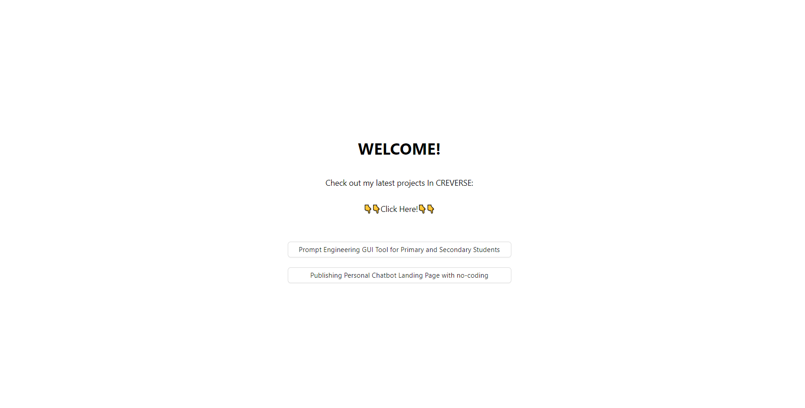
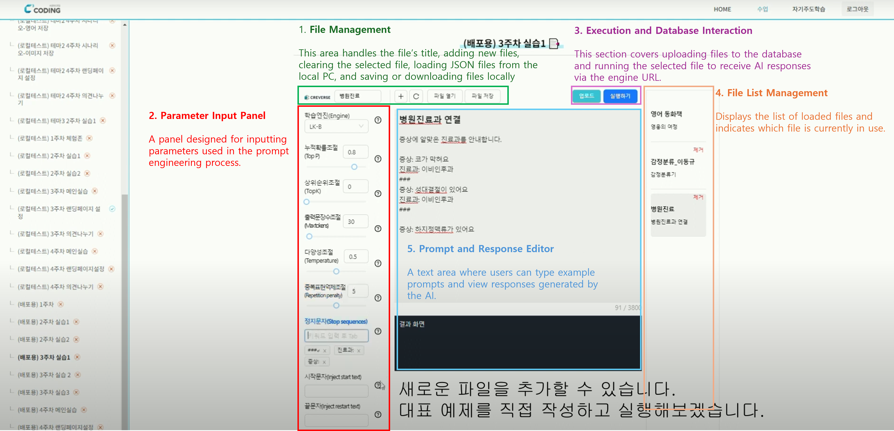

## Project Introduction

### **NOTICE**: This source code is not related to any CREVERSE assets, and all CREVERSE assets are excluded from this project.

This project provides making personalized chatbot via GUI tool and publishing landing page using Naver's HyperClova AI, specifically designed for primary and secondary students.

This project is served within the LCMS system's iframe, where it receives the Class ID and User ID from ERP system. These two key values are used for saving important data.


**The main features of this project are:**

1. A GUI Tool for prompt engineering to easily create your own chatbot.
2. A no-coding solution for setting up and publishing a landing page to showcase your chatbot service.


**Development Period**

- 2023.02.01 ~ 08.11


**My Contribution**

- System Design
  - Gathered needs from content creators
  - Created requirements document
  - Wrote backend API document
- Developing
  - Led the development of system
  - Front-end


## Installation and Running

### Requirements

- Node.js (v >= 14.0.0)
- npm (Node Package Manager)


### Tool

- IDE: Visual Studio Code
- Language: Typescript
- Framework: React (v18.3.3)


### Node.js Installation 

To run this project, you need Node.js. If you have already installed Node.js, you can skip the following process.

1. #### Download and Install Node.js 

   Visit the Node.js website and download the latest LTS version according to your OS. After downloading the installer, run and install Node.js 

   

2. #### Verify installation

   On termianl or command propmt, type the following commands in order to check the versions of Node.js and npm.

   ```bash
   node -v
   npm -v
   ```

   If above commands return the version of Node.js and npm, the installation was successful.


### Project Setup and Execution

1. #### Download

   Download the project and unzip it.

   

2. #### Install packages

   Install the project's dependancies by running:

   ```bash
   npm install
   ```

3. #### Start the dev server

   ```bash
   npm start
   ```

4. #### Check in the borwser

   After the server starts, open your browser and go to http://localhost:3000/. You will see the home screen and explore the two key features of this project clicking both two buttons('Prompt Engineering GUI Tool for Primary and Secondary Students', 'Publishing Personal Chatbot Landing Page with no-coding').

   

   

   


## Project Structure 

### 1. Route Pages

#### 1.1. Description

Navigation between pages is managed using react-router-dom


#### 1.2. File Locations in the Project

- **src/App.js**: Contains the routing configuration
- src/pages/: Directory for different pages
  - Home/Home.js: Home page
  - **ClovaStudio/ClovaStudio.js**: GUI Tool for propmt engineering
  - LandingPage/: Directory for the no-coding solution for setting up and publishing a landing page
    - LandingPageSeetings.js: File for setting up a landing page
    - LandingPageLoader.js: Displays the landing page based on the previous selected theme
      - LandingTheme/: Directory containing landing page themes
        - BlackWhite.js
        - BlueHouse.js
        - DeepForest.js


#### 1.3. Library Used

- **react-router-dom**


### 2. Control Global State

#### 2.1. Description

The important values exchanged between components are managed in the global state


#### 2.2. File Locations in the Project

- src/store/index.js: Contains Redux store configurations
  - slices/authSlice.js: Global State and reducers: Class ID and User ID from the external LCMS system to this project
  - slices/ClovaStudioSlice.js: Global State and reducers: fileIndex that user selected
  - slices/landingPageSettingSlice.js: Global State and reducers: Page settings data from DB, like design theme, customed chatbot engine


#### 2.3.  Library Used

- **@reduxjs/toolkit**
- **react-redux**


### 3. Reusable UI Components

#### 3.1. Descriptions

UI components used for page design


#### 3.2. File Locations in the Project

- src/components/: Directory
- ClovaStudioParamsSelector: Selector used in the ClovaStudio Parameters Pannel
- ClovaStudioParamsSlider: Slider used in the ClovaStudio Parameters Pannel
- ClovaStudioParamsTextInput: Text Input used in the ClovaStudio Parameters Pannel
- ErrorPage.js: Verifies authenticated users by checking the Class ID and User ID
- F5KeyAlertModal.js: Prevents users from pressing the F5 key on the landing page settings


#### 3.3. Library used

- **antd**


### 4. Custom Hook

#### 4.1. Descriptions

Custom hooks to verify authentication error, deliver Class ID and User ID and scroll the y-axis to the bottom on the first mount


#### 4.2. File Locations in the Project

- src/hooks/: Directory
- getAuthCheck: Returns wheter an authentication error exist (true or false) and delivers the Class ID and User ID
- useDidMountEffect: Scroll the y-axis to the bottom on the first mount


## Main Feature Areas of GUI Tool

**[Before Excution]**




**[After Excution]**


## User Scenario

**Step 1**: The user logs into the LCMS system and selects the GUI Tool for prompt engineering.

**Step 2**: Using the GUI Tool, the user performs prompt engineering to create a personalized chatbot model.

**Step 3**: The user sets up and publishes the landing page content through the landing page settings.

**Step 4**: A unique URL (/ClassID/UserID) is generated, allowing the user and others to view the published chatbot landing page.

※ For a demonstration of Steps 3 and 4, you can watch the video at the following YouTube link:

https://youtu.be/3OsL2jgHO3M?si=rdQuhNdMvOTxw2h5


## Reflections...

While working at CREVERSE, we needed to develop a system that would allow primary and secondary students to engage in prompt engineering and take home their practical results, due to an MOU with Naver Hyper Clova. As a developer, I not only led the development of the main front-end but also gathered various requirements from content creators for the GUI Tool and documented them. Based on these requirements, I created a storyboard and collaborated with designers to finalize the design concept. Additionally, I wrote the backend API documentation and communicated with backend developers to ensure the preparation of essential elements for the service.

Afterward, I proceeded with front-end development, conducting tests and refining the system in collaboration with content creators. During this process, I was able to address design revisions and backend errors, providing feedback and ensuring necessary corrections were made.

The system was deployed as part of a summer intensive course at two offline learning centers, and over 200 students used it. The system received positive feedback and was integrated not only into the special course but also into the regular curriculum. The source code for the system has since been handed over to my successor and is currently being further enhanced.
